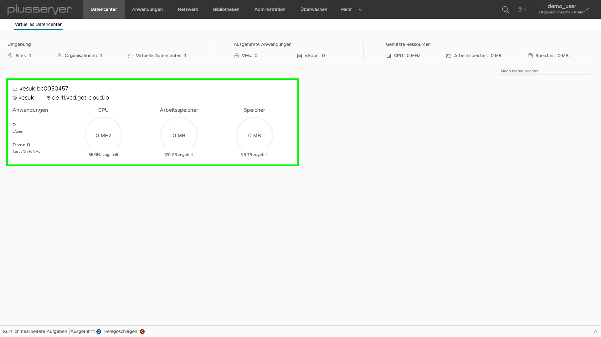
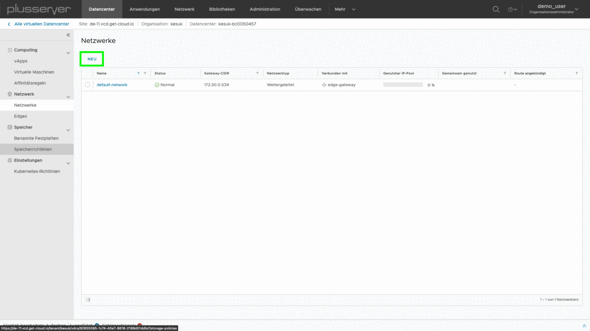

---
# Schnelleinstieg

Dieser Artikel behandelt Schritt für Schritt, wie nach dem initialen Netzwerksetup VMs/vApps erstellt werden und diese final in externe Netze oder an das Internet angebunden werden. Umfangreiche Hilfe in technischen Portaldetails können Sie über das Fragezeichen in der oberen rechten Ecke bei VMware Online einsehen. Bei diesem und anderen Themen steht natürlich unser Support ebenfalls zur Verfügung.

Dieses Dokumentation setzt voraus, dass Sie sowohl Ihre Zugangsdaten (Benutzername und Kennwort) als auch Ihre Mandanten-URL bereits vorliegen haben. Mit diesen Daten kommen Sie direkt in das pluscloud vCloud Director Portal. Zusätzlich ist es hilfreich, Ihre weiteren öffentlichen IP-Adressen griffbereit zu haben. Diese können Sie auch im plusserver-Kundenportal einsehen.

> **Initiales Passwort ändern** Es wird aus Sicherheitsgründen empfohlen, das Administrator-Kennwort beim ersten Login zu ändern.

Nach dem Login in die pluscloud sehen Sie eine Übersicht über das virtuelle Datacenter:

Mit einem Klick auf den im obigen Screenshot grün markierten Bereich gelangen Sie in das virtuelle Datacenter und können dieses administrieren:

---
# Basis-Netzwerkkonfiguration 

Ihrer pluscloud-Umgebung wird automatisch eine VMware Edge-Gateway Appliance zugewiesen. Diese stellt für Ihre Umgebung den Zugang zum Internet zur Verfügung. Des weiteren bietet es diverse Dienste an, z. B. Firewall, Loadbalancing, NAT und VPN. Zu diesem Zeitpunkt erstellte virtuelle Maschinen haben keine Verbindung zur Außenwelt und müssen zunächst über passende NAT- und Firewall-Regeln im Edge-Gateway verbunden werden. 

## Übersicht Organisations-VDC-Netzwerke
Wenn Sie unter Netzwerk auf den Menüpunkt Netzwerke im linken Navigationsmenü klicken, sehen Sie alle bestehenden Netzwerke. Hier sollte bereits ein Organisationsnetzwerk verfügbar sein.

Ihr Organisationsnetzwerk sollte im Namen Ihre Kundennummer enthalten und bei Netzwerktyp den Status Weitergeleitet aufweisen. Die erste Adresse des verwendeten Subnetzes ist hierbei an die Edge-Gateway Appliance gebunden.

Ein fehlendes Organisationsnetzwerk sowie weitere Netze können Sie über die Schaltfläche Neu anlegen.

Beim Typ des zu erstellenden Netzwerks bietet die Option weitergeleitet die Möglichkeit, Ihr Edge-Gateway auszuwählen und externe Kommunikation zu ermöglichen. Isolierte Netzwerke stehen nur Ihren virtuellen Maschinen zur Verfügung und sind von externen Verbindungen abgekoppelt.

Im Wizard für weitergeleitete Netzwerke sind folgende Parameter relevant:

- Typ:  Unterscheidet, ob ein Netz weitergeleitet oder isoliert ist. Nur weitergeleitete Netzwerke bieten eine Konnektivität nach außen und eine Anbindung an das Edge-Gateway.
- Edge-Gateway: Unter diesem Punkt kann die Verbindung zum bereits bestehenden Edge-Gateway hergestellt werden. Als Schnittstellentyp ist im Normalfall "Intern" auszuwählen.
- Gast-VLAN zulassen: Ermöglicht die Erstellung von VLANs mit eigenen Sub-Interfaces. Diese Option wird im Regelfall nicht benötigt und wird nicht empfohlen.
- Distributed Routing:
- Name: Frei definierbarer Name für das zu erstellende Netzwerk. Dient als Referenz, um VMs mit dem Netzwerk zu verbinden.
- Beschreibung: Optionaler Freitext, um weitere Informationen zu hinterlegen (z. B. Zweck und Verwendung des Netzwerks).
- Doual Stack Modus: …
- Gateway CIDR: Angabe der internen IP-Adressen des Gateways, gefolgt von der Angabe des Subnetzes in CIDR Notation (/Maske). 
- Gemeinsame Nutzung mit anderen vDCs in der Organisation: Option, um Netzwerke über mehrere virtuelle pluscloud DCs gemeinschaftlich zu nutzen. Im Regelfalle deaktiviert.
- Statischer IP Pool:  Reservierung von statischen IP-Adressen.
- Primary und Secondary DNS: Die IP-Adressen der zu verwendenden DNS Server. Üblicherweise das Edge-Gateway.
- DNS Suffix: Falls ein spezifischer DNS Suffix benötigt wird, kann dieser hier eingetragen werden und wird automatisch bei den angeschlossenen VMs verwendet.

> **Bitte überarbeiten (Reihenfolge angepasst)** Heißt scheinbar Edge-Verbindung

